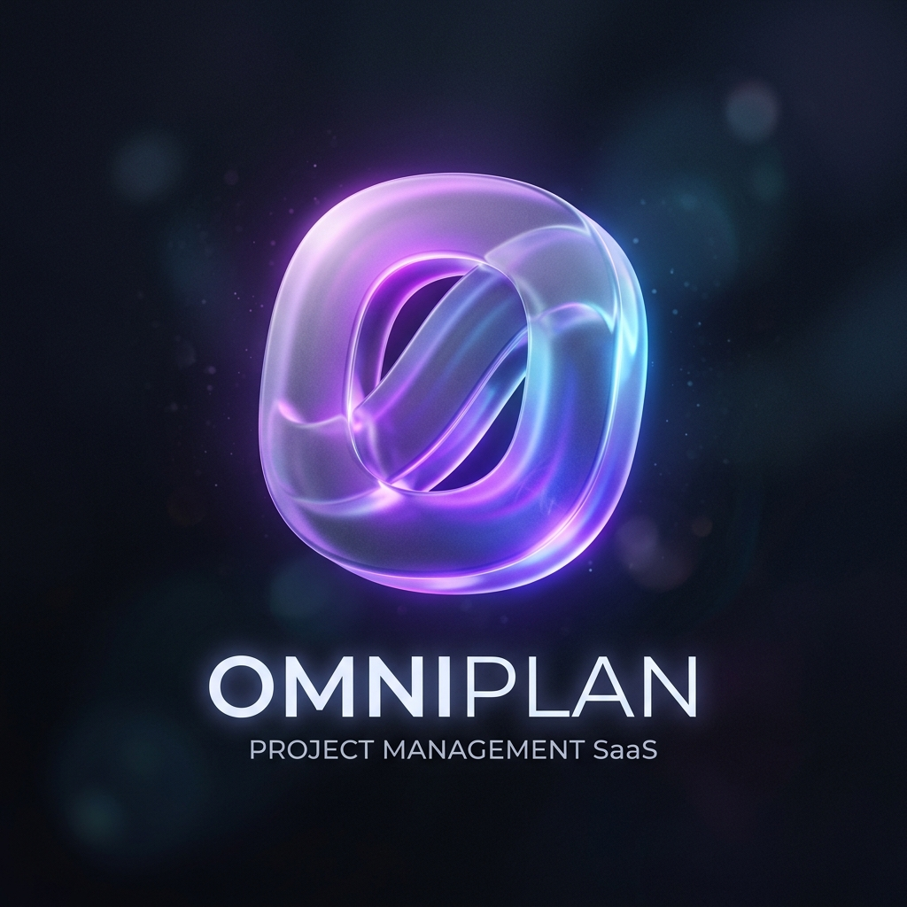

<div align="center">
  
  <h1>OmniPlan</h1>
  <p><strong>The Ultimate Collaborative Project Management Tool</strong></p>
  <p>Built for the <strong>CodeAlpha Full Stack Development Internship</strong> (Task 3).</p>
</div>

---

## 🚀 Overview

**OmniPlan** (formerly Project Planner/AlphaBoard) is an enterprise-grade SaaS project management application. It combines robust Kanban board task management with real-time team collaboration tools, including Discord-style chat and HD video calls, all packaged within a premium, high-fidelity user interface.

## ✨ Key Features

- **Dynamic Kanban Boards**: Drag-and-drop task management powered by `@dnd-kit/core`.
- **Real-Time Text Chat**: Embedded Discord channel integration using `WidgetBot` for seamless team communication.
- **HD Video Collaboration**: In-app private group video and voice calls powered by **LiveKit**, featuring screen sharing and noise suppression.
- **Premium UI/UX**: Sleek, modern interface using **TailwindCSS** and **Framer Motion** for smooth, professional animations and glassmorphic designs.
- **Secure Authentication**: Robust Email verification flow with JWT & bcryptjs, plus seamless Google OAuth integration.
- **Cloud Media Management**: User avatar and banner uploads managed efficiently via **Cloudinary**.

## 🛠️ Tech Stack & Integrations

**Frontend (Client)**
- React 19 & Next.js 14 (App Router)
- TailwindCSS (Styling & Gradients)
- Framer Motion (Animations)
- Zustand (Global State Management)
- Lucide React (Icons)
- LiveKit Components (Video/Audio UI)

**Backend (Server)**
- Node.js & Express.js
- MongoDB & Mongoose (Database)
- JSON Web Tokens (JWT) & bcryptjs (Security)
- LiveKit Server SDK (Video Call Room Generation)
- Cloudinary SDK (Image Uploads)

## ⚙️ Setup Instructions

### Prerequisites
- Node.js installed (v18+ recommended)
- MongoDB running locally or a MongoDB Atlas URI
- Cloudinary Account (for image uploads)
- LiveKit Cloud Account (for video calls)

### Backend Setup

1. Open terminal and navigate to the `backend` folder:
   ```bash
   cd backend
   ```
2. Install dependencies:
   ```bash
   npm install
   ```
3. Create a `.env` file based on your services:
   ```env
   PORT=5000
   MONGODB_URI=your_mongodb_connection_string
   JWT_SECRET=your_super_secret_jwt_key
   JWT_EXPIRES_IN=7d
   
   # Cloudinary
   CLOUDINARY_CLOUD_NAME=your_cloud_name
   CLOUDINARY_API_KEY=your_api_key
   CLOUDINARY_API_SECRET=your_api_secret

   # LiveKit
   LIVEKIT_API_KEY=your_livekit_key
   LIVEKIT_API_SECRET=your_livekit_secret
   LIVEKIT_URL=wss://your-project.livekit.cloud
   
   # SMTP Email Verification
   SMTP_HOST=smtp.gmail.com
   SMTP_PORT=587
   SMTP_USER=your_email@gmail.com
   SMTP_PASS=your_app_password
   ```
4. Start the backend server:
   ```bash
   npm run dev
   ```

### Frontend Setup

1. Open a new terminal and navigate to the `client` folder:
   ```bash
   cd client
   ```
2. Install dependencies:
   ```bash
   npm install
   ```
3. Start the Next.js development server:
   ```bash
   npm run dev
   ```
4. Access the application at `http://localhost:3000`.

## 🎓 Internship Submission
- **Intern Name**: Gaurav Maurya
- **Domain**: Full Stack Development
- **Company**: CodeAlpha
